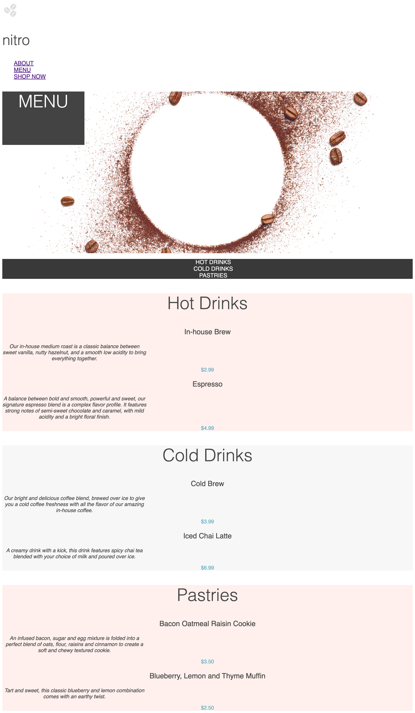
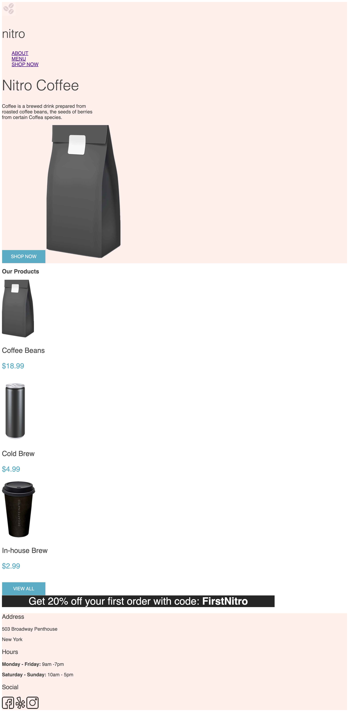

# 1. Coffee Shop: Styling the Menu

So far, we have created the structure for the Nitro Coffee menu. To make it more attractive to customers, we need to add some design.

With your knowledge about basic CSS properties, use the mockup and style guide provided to create the following menu design. To be able to properly position the hero image, use CSS to add the image.

##  
 
# 2. Coffee Shop: Styling the Landing Page

So far, we have created the structure for the Nitro Coffee landing page. To make it more attractive to customers, lets add some basic styling.

With your knowledge about basic CSS properties, use the mockup and style guide provided to recreate the following landing page design.

##  

